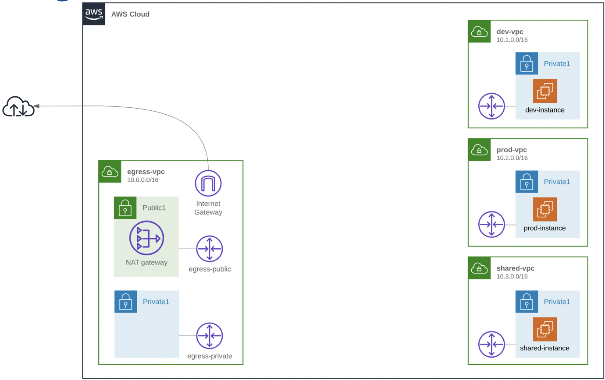
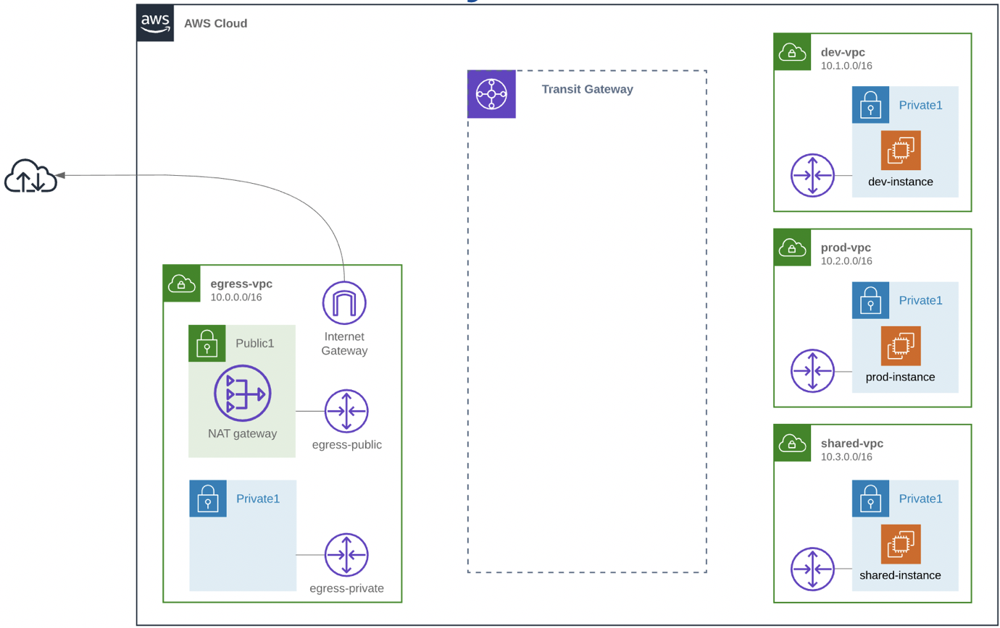
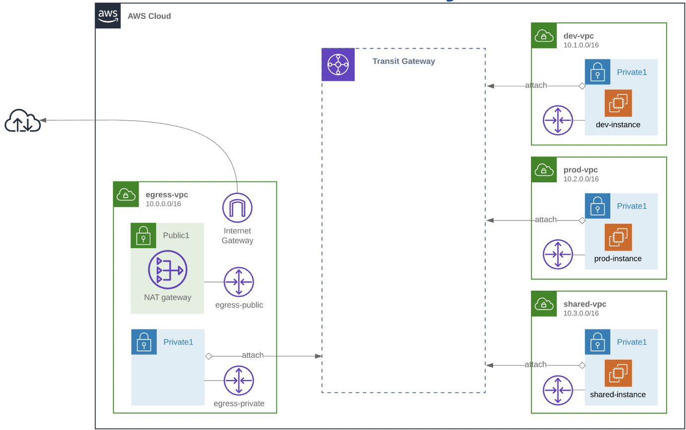
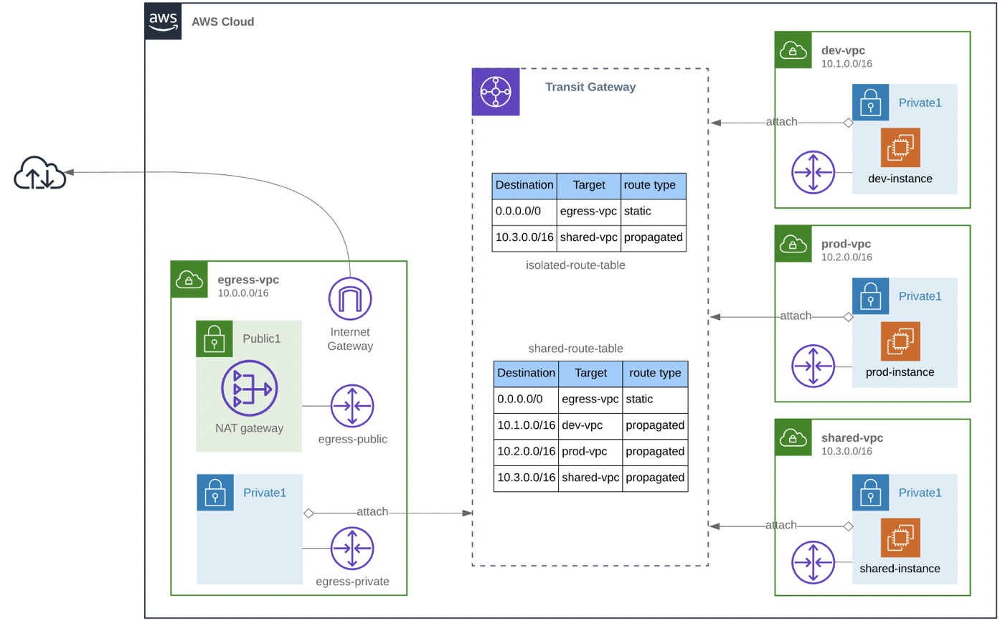
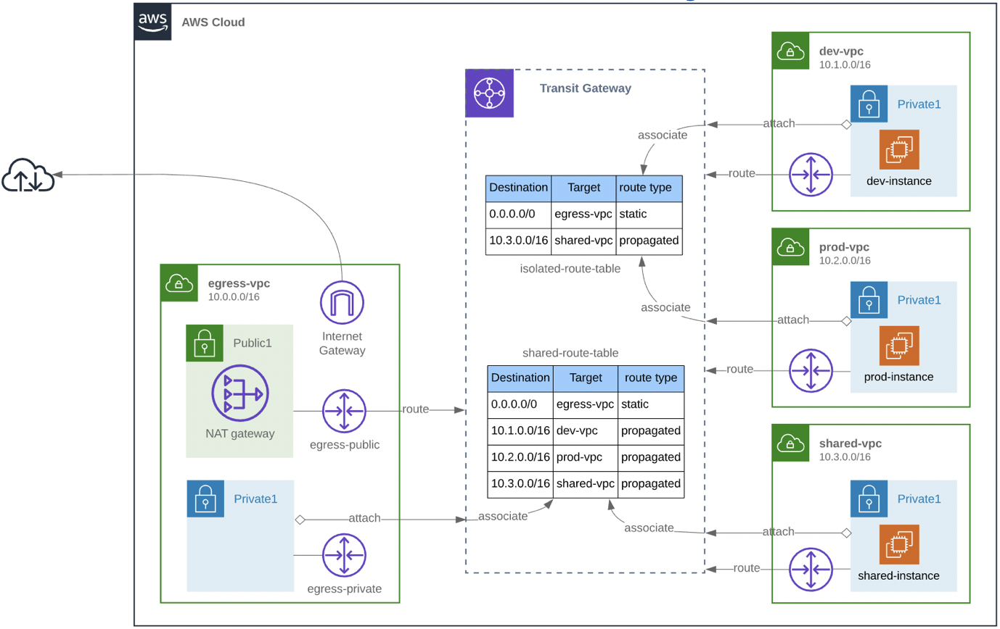

## Summary:

In this lab we will learn how to build and run a centralised NAT/Egress solution using Transit Gateway. We have deployed 4 different VPCs in the same region and also in the same account. We have a Dev, Prod, Shared and Egress VPC. These VPCs could be located in different AWS accounts, but for this lab it is more convenient to have it in a single account. 

There is a requirement to be able to connect to the internet from the three VPCs (Dev, Prod and Shared) which are hosting EC2 instances. In this case we want a single egress point because for example we want to consolidate the NAT gateways or we have specific security requirements. We can’t use VPC peering, because transitive routing is not supported. 

We want a strict separation between Prod and Dev, so we don’t want to allow instances in them to be able to communicate to each other. 
The Shared VPC is intended for shared services so the instances in Dev and Prod VPC need to be able to connect to the Shared VPC. To meet this requirement we could use VPC peering, but this does not scale very well. 
The diagram below illustrates the high level architecture the lab will be using. 

  

We want to use Transit Gateway for connecting the different VPC together.  

### Step-1 : Test current connections

Let's first test the connections to prove we cannot connect.

**Web Console:**
Go to Systems Manager on the AWS Web console in the eu-west-1 region.

- Click on "Session Manager" under "Actions"
- Click on "Start Session"
- Select your Dev instances (studentxx-dev-instance) and click Start Session

- In Terminal Session window for Test Instance, now you can test the internet reachability via following shell commands:
  - Test the connection to the Internet:
    - ping 1.1.1.1
    - links https://www.checkmyip.com
    - NOTE: The Public IP Address displayed would be the NAT-GW from Egress VPC.
  - Test the connection to the Prod VPC: 
    - ping \<ip\> (lookup IP of studentxx-prod-instance in EC2 Management Console)
  - Test the connection to the Shared VPC:
    - ping \<ip\> (lookup IP of studentxx-shared-instance in EC2 Management Console)

As you can see it does not work. We need to setup Transit Gateway, so the first step is to create a Transit Gateway

### Step-2 : Create Transit Gateway

  

**Web Console:**

Go to VPC on the AWS Web console in the eu-west-1 region.
- VPC > Transit Gateway > Create Transit Gateway
  - Name: studentxx-transit-gateway
  - Amazon Side Asn: 64512 (leave default)
  - Default Route Table Association: disable (we don’t want to use the default Transit Gateway route table, we want to use custom ones)
  - Default Route Table Propagation: disable
  - Auto Accept Shared Attachments: enable	
  - Create

### Step-3 : Attach VPCs to Transit Gateway

The next step is to attach the different VPCs to the Transit Gateway, so we need to create Transit Gateway Attachments for each VPC:

  

**Web Console:**

Create the Transit Gateway Attachment for the Egress VPC:
- VPC > Transit Gateway Attachments > Create Transit Gateway Attachment
  - Transit Gateway ID: Select the Transit Gateway that you just created (studentxx-transit-gateway)
  - Attachment type: VPC
  - Attachment name tag: studentxx-egress-attachment
  - VPC ID: studentxx-egress-vpc
  - Subnet IDs: studentxx-egress-private1-subnet
  - Create

Create the Transit Gateway Attachment for the Prod VPC:
- VPC > Transit Gateway Attachments > Create Transit Gateway Attachment
  - Transit Gateway ID: Select the Transit Gateway that you just created (studentxx-transit-gateway)
  - Attachment type: VPC
  - Attachment name tag: studentxx-prod-attachment
  - VPC ID: studentxx-prod-vpc
  - Subnet IDs: studentxx-prod-private1-subnet
  - Create

Create the Transit Gateway Attachment for the Dev VPC:
- VPC > Transit Gateway Attachments > Create Transit Gateway Attachment
  - Transit Gateway ID: Select the Transit Gateway that you just created (studentxx-transit-gateway)
  - Attachment type: VPC
  - Attachment name tag: studentxx-dev-attachment
  - VPC ID: studentxx-dev-vpc
  - Subnet IDs: studentxx-dev-private1-subnet
  - Create

Create the Transit Gateway Attachment for the Shared VPC:
- VPC > Transit Gateway Attachments > Create Transit Gateway Attachment
  - Transit Gateway ID: Select the Transit Gateway that you just created (studentxx-transit-gateway)
  - Attachment type: VPC
  - Attachment name tag: studentxx-shared-attachment
  - VPC ID: studentxx-prod-vpc
  - Subnet IDs: studentxx-prod-private1-subnet
  - Create

### Step-4 : Create Transit Gateway Routing tables 

Now that each VPC is attached to the Transit Gateway, we need to setup a routing tables that meet our requirements. When we created the Transit Gateway we did not select the default route table association, because that would make it possible for all VPCs to route to each other and we need a strict separation between Prod and Dev. We need to create two different Transit Gateway routing tables: 
- one for Egress VPC and Shared VPC because they need a route to all VPCs 
- one for Dev and Prod VPC because they need the routes to the Egress and Shared VPCs only, because we don’t include routes to Dev and Prod VPC they are not able to communicate to each other

First create the routing table for Egress and Shared VPC

  

**Web Console:**

Create the Transit Gateway Route Table for Egress and Shared VPC:
- VPC > Transit Gateway Route > Create Transit Gateway Route Table
  - Name tag: studentxx-shared-routing-table
  - Transit Gateway ID: Select the Transit Gateway that you created earlier (studentxx-transit-gateway)
  - Create

Wait for the creation until the state becomes available (refresh). 

Now we can associate the Egress and Shared VPC (attachment) to this routing table, so they will use this routing table when traffic is being directed to the Transit Gateway:
- Select the route table (studentxx-shared-routing-table) > Associations tab > Create propagation
  - Choose attachment to associate: Select the Egress Transit Gateway Attachment that you just created (studentxx-egress-attachment)
- Select the route table (studentxx-shared-routing-table) route table > Associations tab > Create association
  - Choose attachment to associate: Select the Shared Transit Gateway Attachment that you just created (studentxx-shared-attachment)

The VPCs are ready to use the routing table, but the routing table does not contain any routes yet. For this shared routing table we need to create a static default route, because we want the Shared VPC to be able to connect to the Internet through the Egress VPC:
- Select the route table (studentxx-shared-routing-table) > Routes tab > Create route
  - Choose attachment: Select the Egress Transit Gateway Attachment that you just created (studentxx-egress-attachment)

We also need the dynamic routes to all of the other VPCs (Dev, Prod and Shared), so we need to create the propagation for each VPC:
- Select the route table (studentxx-shared-routing-table) > Propagations tab:
  - Create propagation
    - Choose attachment to propagate: Select the Shared Transit Gateway Attachment that you just created (studentxx-dev-attachment)
  - Create propagation
    - Choose attachment to propagate: Select the Shared Transit Gateway Attachment that you just created (studentxx-prod-attachment)
  - Create propagation
    - Choose attachment to propagate: Select the Shared Transit Gateway Attachment that you just created (studentxx-shared-attachment)

Select the Routes tab to see all 4 routes. The Egress VPC and Shared VPCs are ready to communicate, now we also need a Transit Gateway routing table for the Dev and Prod VPC:
- VPC > Transit Gateway Route > Create Transit Gateway Route
  - Name tag: studentxx-isolated-routing-table
  - Transit Gateway ID: Select the Transit Gateway that you created earlier (studentxx-transit-gateway)
  - Create

Wait for the creation until the state becomes available (refresh). 

Now we can associate the Dev and Prod VPC (attachment) to this routing table, so they will use this routing table when traffic is being directed to the Transit Gateway:
  - Select the route table (studentxx-isolated-routing-table) > Associations tab > Create propagation
    - Choose attachment to associate: Select the Dev Transit Gateway Attachment that you just created (studentxx-dev-attachment)
  - Select the route table (studentxx-isolated-routing-table) route table > Associations tab > Create association
    - Choose attachment to associate: Select the Prod Transit Gateway Attachment that you just created (studentxx-prod-attachment)

The Dev and Prod VPCs are ready to use the routing table, but the routing table does not contain any routes yet. For this isolated routing table we need to create a static default route, because we want the VPCs to be able to connect to the Internet through the Egress VPC:
  - Select the route table (studentxx-isolated-routing-table) > Routes tab > Create route
    - Choose attachment: Select the Egress Transit Gateway Attachment that you just created (studentxx-egress-attachment)

We also need the dynamic routes to the Shared VPC, because the Dev and Prod VPC need to communicate to Shared VPC. We need to create the propagation for the Shared VPC:
  - Select the route table (studentxx-isolated-routing-table) > Propagations tab:
    - Create propagation
      - Choose attachment to propagate: Select the Shared Transit Gateway Attachment that you just created (studentxx-shared-attachment)

### Step-6 : Create routes to the from the VPC to the Transit Gateway

  

Now the Transit Gateway has been setup correctly, we still cannot connect to the other VPCs. This is because each routing table in the VPC does not contain the route to the Transit Gateway. Traffic is not being directed from the VPC to the Transit Gateway. We will need to setup a default route in the routing tables that exist in the Dev, Prod and Shared VPC. 

**Web Console:**

VPC > Route Tables > Filter on your name (student):
- Select the Dev Routing table (student12-dev-route-table) > Routes tab > Edit routes
  - Destination: 0.0.0.0/0
  - Target: Transit Gateway (studentxx-transit-gateway)
- Select the Prod Routing table (student12-prod-route-table) > Routes tab > Edit routes
  - Destination: 0.0.0.0/0
  - Target: Transit Gateway (studentxx-transit-gateway)
- Select the Shared Routing table (student12-shared-route-table) > Routes tab > Edit routes
  - Destination: 0.0.0.0/0
  - Target: Transit Gateway (studentxx-transit-gateway)

For the Egress VPC we need a route back to different VPC. We will add a specific route for the private ip space. Please note that we need to add the route to the public route table, because the NAT Gateway has an attachment in the public subnet. 
VPC > Route Tables > Filter on your name (student):
- Select the Egress Routing table (student12-egress-public1-route-table) > Routes tab > Edit routes
  - Destination: 10.0.0.0/8
  - Target: Transit Gateway (studentxx-transit-gateway)

### Step-5 : Test & Play ! 

**Web Console:**
Go to Systems Manager on the AWS Web console in the eu-west-1 region.

- Click on "Session Manager" under "Actions"
- Click on "Start Session"
- Select your Dev instances (studentxx-dev-instance) and click Start Session

- In Terminal Session window for Test Instance, now you can test the internet reachability via following shell commands:
  - Test the connection to the Internet:
    - ping 1.1.1.1
    - links https://www.checkmyip.com
    - NOTE: The Public IP Address displayed would be the NAT-GW from Egress VPC.
  - Test the connection to the Prod VPC: 
    - ping \<ip\> (lookup IP of studentxx-prod-instance in EC2 Management Console)
  - Test the connection to the Shared VPC:
    - ping \<ip\> (lookup IP of studentxx-shared-instance in EC2 Management Console)

### Learn more about TGW:

- Introducing AWS Transit Gateway (NET331) https://www.youtube.com/watch?v=yQGxPEGt_-w
- AWS Transit Gateway & Transit VPCs, Ref Arch for Many VPCs (NET402), https://www.youtube.com/watch?v=ar6sLmJ45xs
- VPC Fundamentals and Connectivity Options (NET201) https://www.youtube.com/watch?v=jZAvKgqlrjY